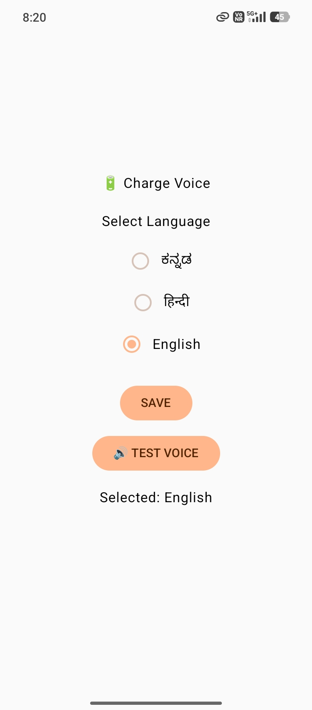
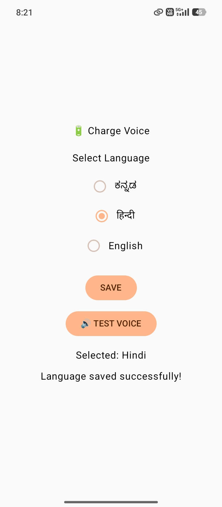

# 🔋 ChargeVoice

### Multilingual Android Charging Voice Assistant

**ChargeVoice** is an Android application that provides voice announcements for important phone charging events. It can announce when the charger is connected, disconnected, and when the battery reaches important levels.

The application supports **English, Kannada, and Hindi** voice announcements.

---

## ✨ Features

* 🔌 **Charger Connected Voice**
  * Announces when the phone starts charging.

* 🔌 **Charger Disconnected Voice**
  * Announces when the charger is removed.

* 🔋 **Full Battery Announcement**
  * Announces when the battery reaches 100%.

* 📊 **Battery Percentage Announcements**
  * Announces selected battery levels such as 25%, 50%, 75%, and 90%.

* ⚠️ **Low Battery Alert**
  * Provides a voice warning when the battery level is low.

* 🌐 **Multilingual Support**
  * 🇬🇧 English
  * 🇮🇳 Kannada
  * 🇮🇳 Hindi

* ⚙️ **Background Operation**
  * Charging events can be detected even when the app screen is closed.

* 🔄 **Restart Support**
  * The charging monitoring service can start again after the phone restarts.

* 💾 **Language Selection**
  * The selected language is saved for future charging announcements.

---

## 🛠️ Technologies Used

* **Kotlin**
* **Android Studio**
* **Android SDK**
* **Text-to-Speech (TTS)**
* **Foreground Service**
* **BroadcastReceiver**
* **SharedPreferences**
* **Android BatteryManager**

---

## 📱 How It Works

1. Open **ChargeVoice**.
2. Select your preferred language.
3. Press **SAVE**.
4. Connect the charger.
5. ChargeVoice announces the charging status.
6. Disconnect the charger to hear the disconnection announcement.
7. The app can continue monitoring charging events in the background.

---

## 📸 Screenshots

### 🇬🇧 English Language Selection



### 🇮🇳 Hindi Language Selection



---

## 🔊 Supported Languages

| Language | Support |
|----------|---------|
| English  | ✅ |
| Kannada  | ✅ |
| Hindi    | ✅ |

> Voice availability depends on the Text-to-Speech language data installed on the Android device.

---

## 📂 Project Structure

```text
ChargeVoice/
├── app/
│   ├── src/
│   │   └── main/
│   │       ├── java/
│   │       │   └── com/example/chargevoice/
│   │       │       ├── MainActivity.kt
│   │       │       ├── ChargingService.kt
│   │       │       └── BootReceiver.kt
│   │       ├── res/
│   │       └── AndroidManifest.xml
│   └── ...
├── screenshots/
│   ├── chargevoice_english.jpeg
│   └── chargevoice_hindi.jpeg
├── gradle/
├── build.gradle.kts
├── gradle.properties
├── settings.gradle.kts
└── README.md
